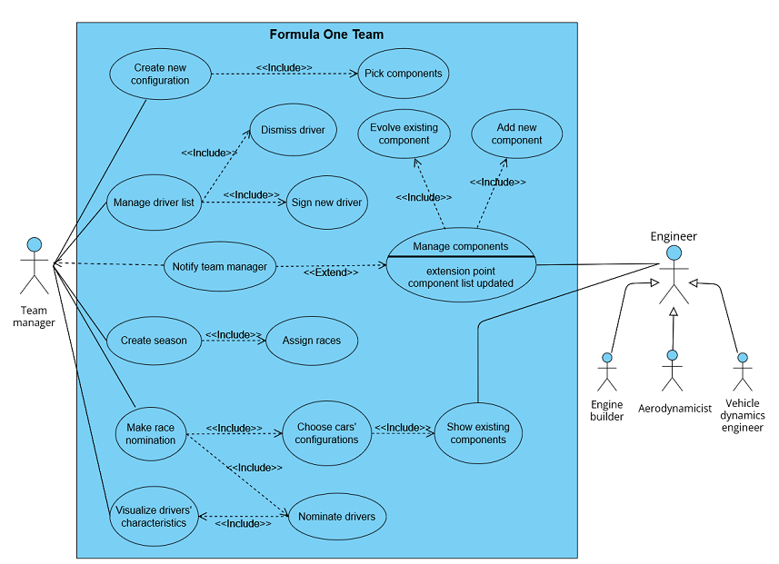
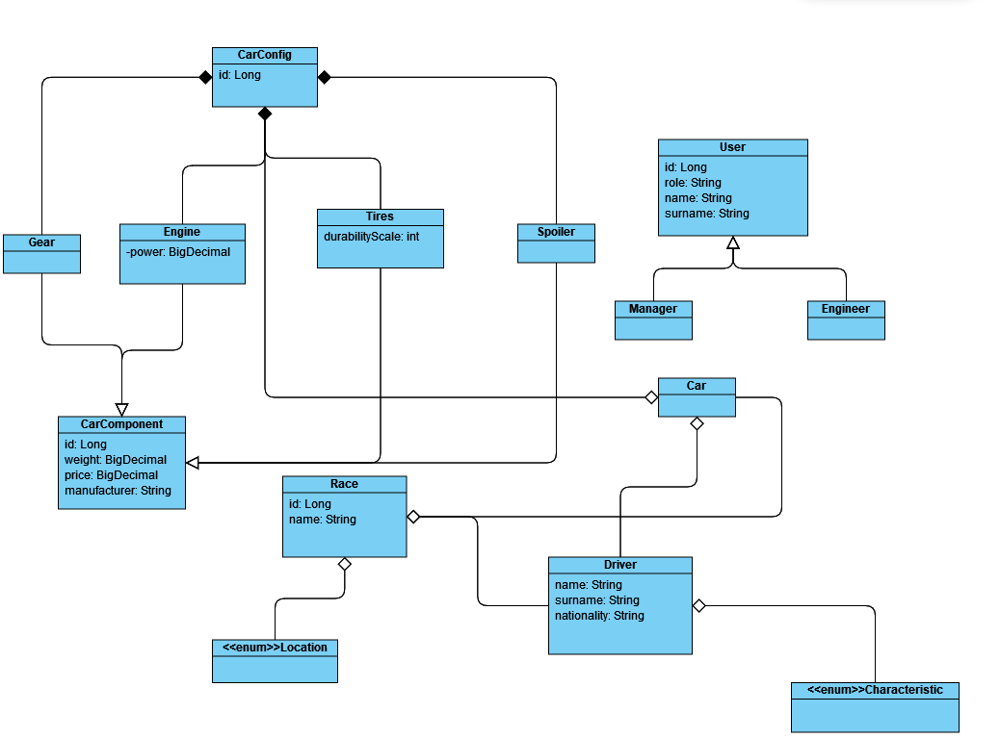
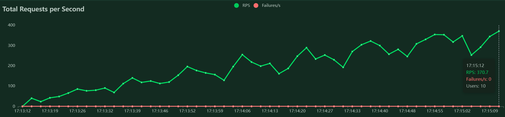
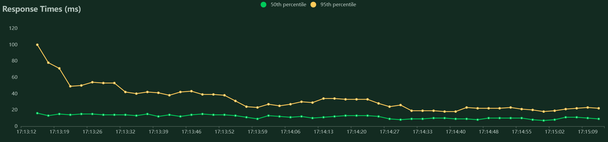

# PA165 Formula One Team

## Team members:

| Name                  | Role                                     | GitLab login | UČO        |
|:----------------------|:-----------------------------------------|:-------------|:-----------|
| Diana Gulčíková       | Team leader, medior Java developer       | @xgulcik     | 493356     |
| Tomáš Marek           | Junior Java developer                    | @xmarek14    | 485386     |
| Andrej Šimurka        | Junior Java developer                    | @xsimurka    | 492781     |
| Oto Stanko            | Junior Java developer                    | @xstanko     | 493068     |

## Project description

Formula 1 manager for team, where a manager can accept, and dismiss driver for a team,
also manager can pick a driver for a specific car and assign this Car, Driver pair for 
a race configuration. Technicians can evolve new components and manager picks these 
components for a car.

## Official assigment:

A Formula 1 team is in need to manage its participation to the world championship. The team 
has two cars participating to each race, each one driven by one driver, with other test 
drivers available to develop the car further. The manager of the team can set the driver for 
each car and manage a list of other (test) drivers that are under contract and he can also 
set as main drivers if unhappy about results. Each driver has a name, surname, nationality, 
and set of characteristics (e.g. driving on the wet, aggressiveness, etc..) that the manager 
can visualize. The car is composed of several components (engine, suspensions), that the 
different departments of the team (e.g. engine, aerodynamics) evolve during time. The manager 
can pick from a list of components and assemble the cars that will participate to the next race. 
Engineers from other departments can login to the system and put newer components available. 
The manager is notified that those components are available and that they can be used to improve 
the car.

## Project structure

Project contains following modules as microservices.

This README contains commands to run individual components as well as commands
to create Docker images. Each image can run on its own, or you can run the whole
app using Docker Compose in project root folder.

### Recommended approach to run the app:

Make sure that nothing is running on following ports:

|Port | Service            |
|---- | -------------------|
|8081 | Race module        |
|8082 | Car module         |
|8083 | Driver module      |
|8084 | Component module   |
|9090 | Prometheus         |
|3000 | Grafana            |

Run these commands in project root folder:

`mvn clean install`

`> docker compose up --build`

Now you can access individual endpoints on address `http://localhost:[port]/swagger-ui/index.html#/` and see
Grafana dashboard on address `http://localhost:3000` (username: admin, password: admin) in menu under Dashboards > 
Main Formula One Dashboard. This dashboard shows how long is the app running, what is the CPU usage and also status 
of individual microservices.

Keep in mind that the start-up is not immediate - give it some time after executing the commands and try to reload
the page.

## Modules:

### Security

Unfortunately we were unable to sync up grafana with security and modules communication,
so security bean has commented area in each module. When you uncomment it,
the security loads and asks for muni authentication.

### common library

Common classes used across the application.

### car

`mvn -pl car spring-boot:run`

Management of cars.
Runs on port 8082.
Extended functionality for car module: For a given car and its component, both given by their respective IDs,
a list of sparse components can be fetched from carComponent module. A sparse component is any component
with the same name as the given component of the car that is not used by the car.

WARNING: when putting components or drivers, services component and driver need to run.

##### Run component using Docker:
Create the image: 

`> docker build --no-cache -t pa165-formula-one-team-car .`

Run the image:

`> docker run -p 8082:8082 pa165-formula-one-team-car`

### component

`mvn -pl component spring-boot:run`

Management of components.
Runs on port 8084.

#### Run component using Docker:
Create the image:

`> docker build --no-cache -t pa165-formula-one-team-component .`

Run the image:

`> docker run -p 8084:8084 pa165-formula-one-team-component`

### driver

`mvn -pl driver spring-boot:run`

Management of drivers.
Runs on port 8083.

#### Run component using Docker:
Create the image:

`> docker build --no-cache -t pa165-formula-one-team-driver .`

Run the image:

`> docker run -p 8083:8083 pa165-formula-one-team-driver`

### race

`mvn -pl race spring-boot:run`

Management of races. Extended functionality for this module 
is endpoint findMostSuitableDriverForLocation. This endpoint finds drivers with max
points from all races at given location. 

WARNING: when posting race with driver or car assigned,
you have to run also car and driver services in order to check that these objects exist.
You can create race without driverOne and driverTwo.
Corresponding services need to run when also assigning drivers or cars in other endpoints.

Runs on port 8081.

#### Run component using Docker:
Create the image:

`> docker build --no-cache -t pa165-formula-one-team-race .`

Run the image:

`> docker run -p 8081:8081 pa165-formula-one-team-race`

## Diagrams
### Use case

### Class diagram

## Runnable scenario
We performed load tests by performing one runnable scenario using locust python library. 
We provide the python script containing the scenario [here](runnable_scenario/runnable_scenario.py).

### Description 
In this runnable scenario, we simulate the scenario where the manager
wants to create some initial entities of the F1 team, assign them to each
other and finally performs a advanced functionality.
In particular, the manager:
- adds drivers, components, seasons, races and cars
- assign races to seasons
- assign drivers to cars
- set main drivers for cars
- assign drivers for particular races
- assign drivers points they earned
- computes the best resulting driver for each race location

This scenario does not manipulate with car components, so we decided to omit them
and use only fictive cars with no assigned components

### Usage

Install locust (open source load testing tool) through pip by executing the following command:
`pip install locust`

Ensure that you have python version 3.7 or higher by executing command:
`python -version`

Run the runnable scenario script via locust by executing:
`locust -f runnable_scenario.py -P <port>`

Open `http://localhost:<port>` with the port number you specified before and setup the load parameters.

### Properties and results
We simulated the described scenario with 10 fictive users performing the scenario simultaneously 
for the period of 2 minutes and with spawn rate of 10 seconds.
Before the load test execution we cleared all the databases.
Here we present the resulting graphs:

The full data from the load test is stored [here](runnable_scenario/load_test_data.csv). 